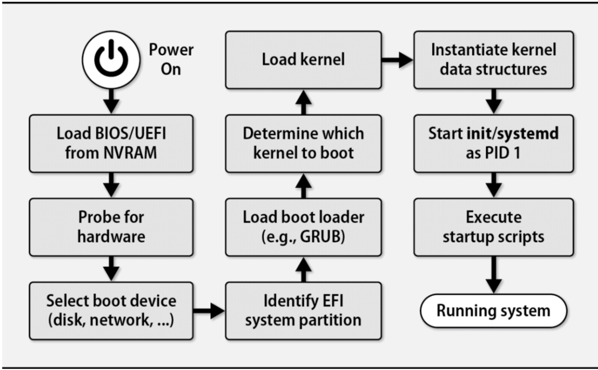

# man page stracture

## Booting and System Management Daemons

Boot Process Tasks:
- Bootstrap
- OS kernel
- scripts and system daemons
- process hygien and system state transitions

### Boot process overview

`systemd` sytem manager daemon

#### BIOS vs UEFI

`BIOS` basic input/output sytem  

`UEFI` unified extensible firmware interface

-- Unix-and-linux-system

###### Linux/Unix boot process




### Boot Loader

job:  
1. identify and load a operation system kernel.
2. marshaling of configuration arguments for the system kernel .

### GRUB : The GRand Unified Boot Loader

#### config

`boot/grub/grub.cfg`

eidt `/etc/default/grub` run `upate-grub` or `grub-mkconfig` to generate `grub.cfg`.

`/etc/grub.d/40_custom` change the order, run `upate-grub` or `grub-mkconfig`

#### command line 

type `c` at the GRUB boot screen enter command-line mode.


### System management daemons

`Traditional init` `init` `systemd` `launchd`

`networkd` 

kernel log entries `journald` 

logins `logind`

### System in detail

`systemctl` investigate the status of `systemd` 

`systemctl isolate multi-user.target` stop other units but the state target  on system is running.

`systemctl get-default` see the target the system boots into by default.

`systemctl add-wants multi-user.target my.local.service` muti-user.target add dependency `my.local.service`


`systemd loggin` log messages produced by the kernel

`journald` daemon help capture kernel and service logs.  
message are stored in `/run` dir.With `journalctl` command directly access the logs;

`/etc/systemd/journald.conf` file is `journald` configure file; 


### Stratagems for a nonbooting system

system can't boot :
- resotre the system to a known-good state
- bring the system up just enough to runa shell, and debuging interactively
- Boot a separate system image, mount the risk system's filesystems, and investigate from there.

#### Single-user mode

`rescue.target` rescue mode. 

``` bash
# mnount -o rw,remount /dev/gpt/rootfs  / # remount dir /
```


## Access Control and Rootly Powers


