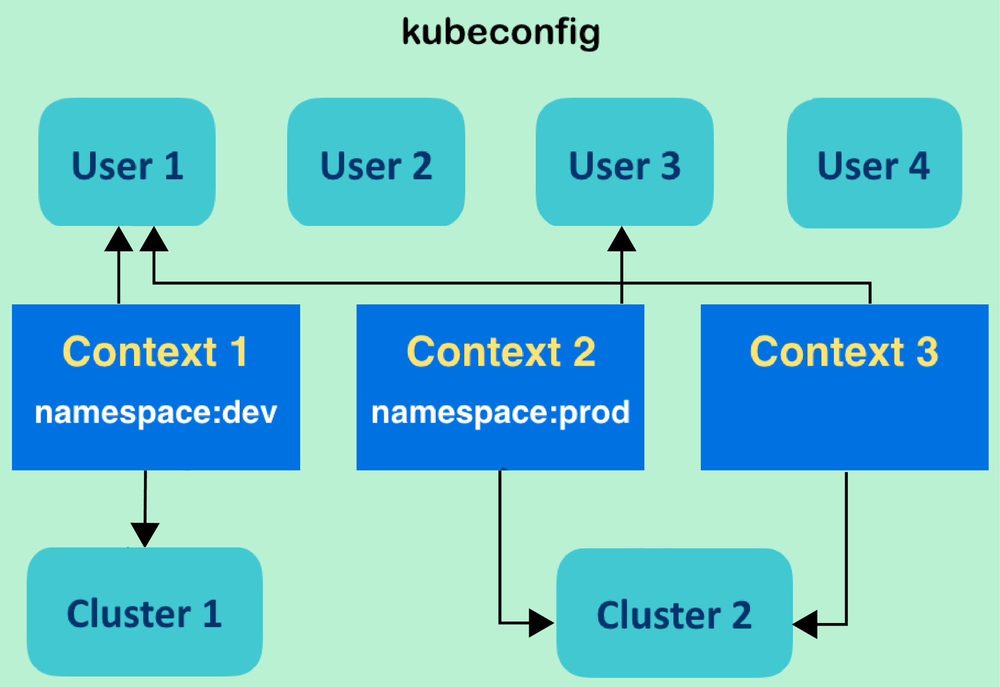

# Goal

1. 深入理解Linux操作系统, 掌握主流linux服务器系统安装配置维护能力 
2. 熟悉常见的服务器基础设施（Nginx、Rabbitmq、Kafka、Mysql、Redis 、ELK、Jenkins、Gitlab、Memcache、Tomcat等）的安装、维护和优化; 
3. 熟悉CI/CD技术和流程，有项目持续集成经验，使用过Jenkins+Maven+Nexus+Git等工具 
4. 熟悉微服务，网关、熟悉网关配置，能合理的实施负载均衡 
5. 熟悉docker以及任务编排，熟悉k8s架构，容器化经验2年以上； 
6. 熟悉主流云计算产品，对云计算产品的配置管理有一定经验。 
7. 熟练掌握开源监控软件zabbix prometheus等 
8. 熟悉Python语言，熟悉Shell脚本编写，有一定编程能力； 
9. 熟悉shell脚本编写, 具备python和golang语言开发能力 
10. 熟悉常用NAS设备，精通分布式存储系统ceph 
11. 至少熟悉一种配置管理工具, 如salt, ansible等 
12. 掌握RAID，ipmi等服务器技术原理和应用 

------
# K8S


## HA
__TTL Mechanism__ and __Lease__ 

`bidirectional gRPC stream`

## 自签名SSL证书

```
$ mkdir secrets
$ openssl req -newkey rsa:4096 -nodes -sha256 -keyout secrets/domain.key -x509 -day 365 -out secrets/domain.crt
$ ls secrets
$ openssl rand -hex -out secrets/http.secret 8
$ docker run -i httpd /bin/bash -c 'echo my-super-secure-password | /usr/local/apache2/bin/htpasswd -nBi user01' > secrets/registry_passwd
$ kubectl create secret generic registry-secrets --from-file secrets/

```


## 集群管理高级

### kubeconfig 高阶配置

__kubeconfig__ 管理集群、上下文、认证；可以在不同集群不同上下文进行环境的切换

`kubectl config`



```
# 查看 kubernetes 配置
$ kubectl config view
......

# 备份
$ cp ~/.kube/config ~/original-kubeconfig

# 查看配置具体选项
$ kubectl config set-credentials -h
# 复制到新目录
$ cp ~/original-kubeconfig ~/new-kubeconfig
# 添加用户
$ kubectl config set-credentials local@local.com --username=local-local --password=123qwe --kubeconfig="new-kubeconfig"
```

#### Context
`Context` 包含了cluster, namespaces, user;

```
# 设置Context
S kubectl config set-context <context_name> --user=<credential_name> --namespaces=<namespace_name> --cluster=<cluster_name>
$ kubectl config set-context defalut/local/local --user=local@local.com --namespaces=defalut --cluster=cluster.local

# 查看配置
$ kubectl config view 

# 当前上下文
$ kubectl config current-context

# 切换上下文
$ kubectl config use-context defalut/local/local

# 删除
$ kubectl config delete-cluster local-cluster

$ kubectl unset local@local.com

$ cp ./original-kubeconfig ~/.kube/config

```


### node 资源配置

### WebUI

### RESTful API

### Kubernetes DNS

### Authentication and Authorization
