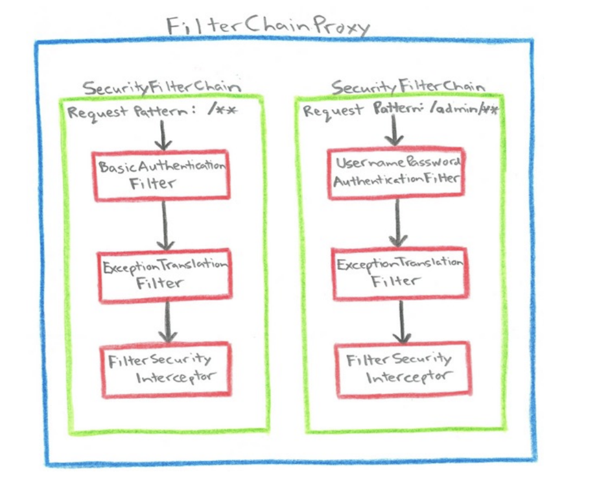

# Spring Security
## Authentication
 Principal : userName   -> UserDetail
 Credentials : Password -> ---
 Authorities:           -> ROLE_USER
 Authenticated:         -> True

## Authentication
- `AuthenticationFilter` 创建AuthenticationRequest，传给`AuthenticationManager`
- `AuthenticationManager` 委托`AuthenticationProvider`
- `AuthenticationProvider` 使用`UserDetailsService`获取用户认证信息
- `AuthenticationFilter`将`Authentication`放置在ThreadLocal的`SecurityContext`中。

## Authorization
- `FilterSecurityInterceptor`通过请求获取`SecurityMetadata`
- `FilterSecurityInterceptor`通过`SecurityContext`获取`Authentication`
- `Authentication` `Security Metadata` `Request` 传给 `AccessDecisionManager`
- `AccessDecisionManager`委托`AccessDecisionVoter`

## Spring Security Filter Chain


------
# Spring Security Architectureß

## Customizing Authentication Managers

- 全局认证
```java
@Configuration
public class ApplicationSecurity extends WebSecurityConfigurerAdapter {

  // web stuff here
  @Autowired//全局认证管理器ß
  public initialize(AuthenticationManagerBuilder builder, DataSource dataSource) {
    builder.jdbcAuthentication().dataSource(dataSource).withUser("dave")
      .password("secret").roles("USER");
  }

}
```

- 局部认证
```java
@Configuration
public class ApplicationSecurity extends WebSecurityConfigurerAdapter {

  @Autowired
  DataSource dataSource;

  // web stuff here

  @Override //局部
  public configure(AuthenticationManagerBuilder builder) {
    builder.jdbcAuthentication().dataSource(dataSource).withUser("dave")
      .password("secret").roles("USER");
  }

}
```
