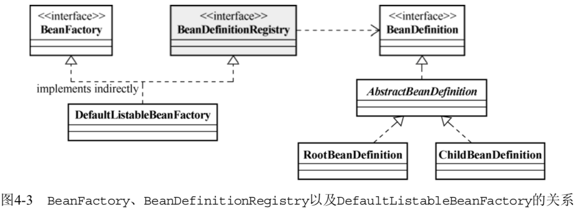
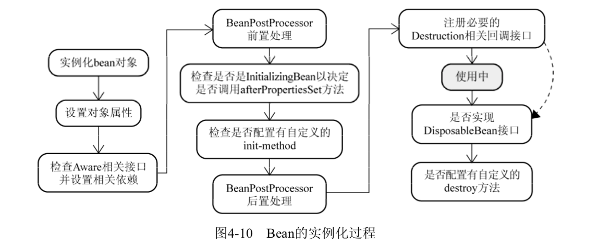
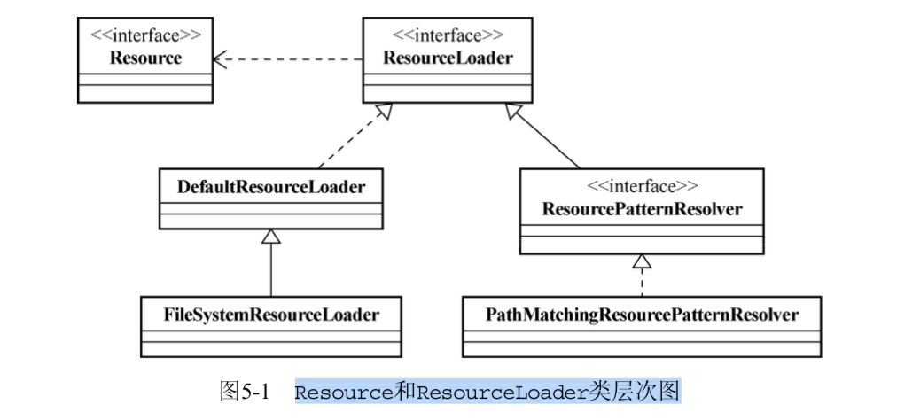
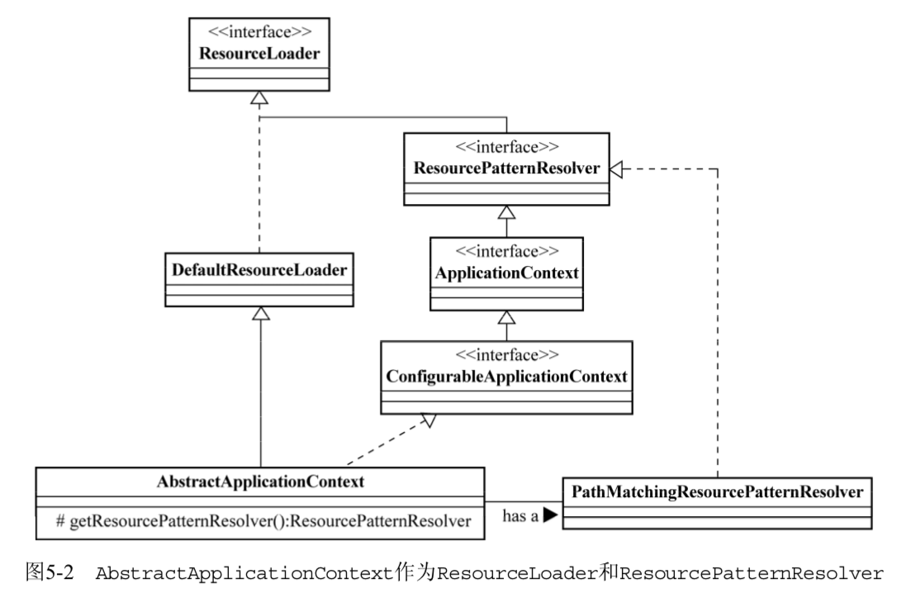
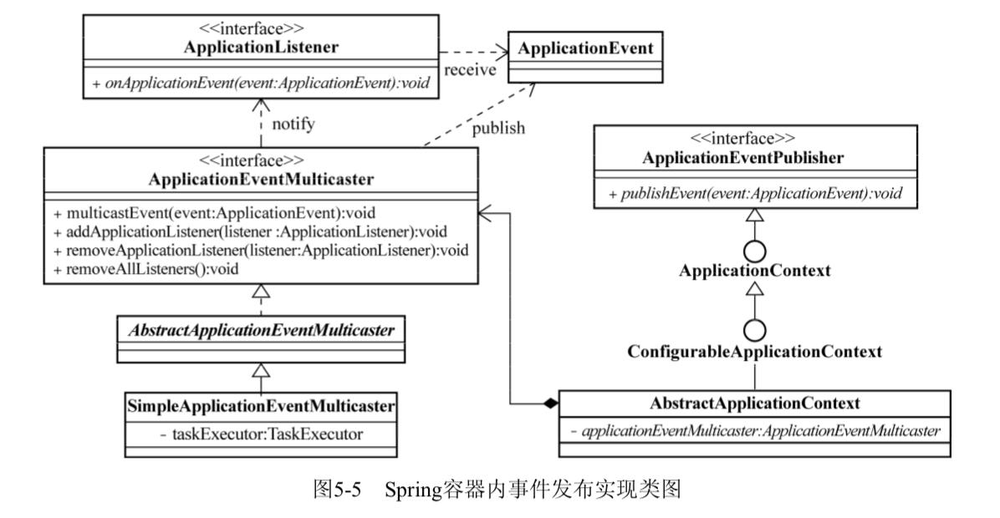
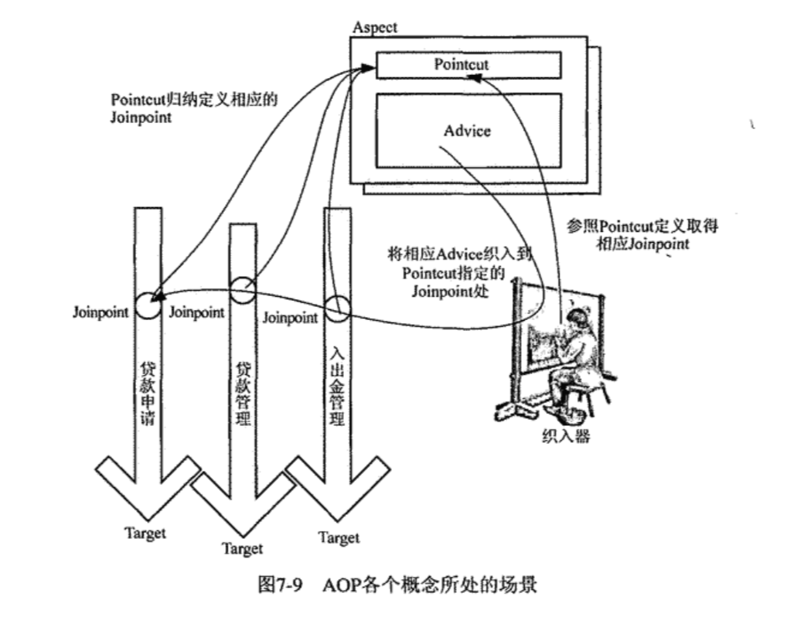

# Spring

## IOC
Spring 提供2种IOC容器：`BeanFactory` `ApplicationContext`
### BeanFactory

BeanFactory 职责：对象的注册和依赖管理

BeanDefinitionRegistry 实现Bean的注册逻辑关系如下：



BeanDefinitionRegistry 管理BeanDefinition(怎么样创建Bean)；  
BeanDefinitionReader 读取BeanDefinition(注解方式则用`classpath-scanning`)；  

BeanFactory 的XML配置

```xml
<beans default-lazy-init default-autowire default-dependency-check default-init-method default-destroy-method>
  <description/>
  <import />
  <alias name="beanName" alias="bean_name"/>
  <bean id="id" class="packag.A" name="beanName" >
    <constructor-arg index="0" ref="otherBeanName"/>
    <constructor-arg type="int">
      <value>123</value>
    </constructor-arg>
    <property name="propertyName" ref="beanName"/>
    <property name="collection">
      <list>
        <value>123</value>
        <ref bean="beanName"/>
        <bean class="beanclassName"/>
      </list>
      <set>
        <value>123</value>
        <ref bean="beanName"/>
        <bean class="beanclassName"/>
      </set>
      <map>
        <entry key="strValueKey">
          <value>something</value>
        </entry>
        <entry>
          <key>objectKey</key>
          <ref bean="someObject"/>
        </entry>
        <entry key-ref="lstKey">
          <list>
            ...
          </list>
        </entry>
      </map>
  </bean>
</beans>
```

Bean Scope : protype singleton request session globalsession
后三种为web应用特有

Scope 接口可以实现自定义Scope类型；

#### 工厂方法与 FactoryBean
1. 静态工厂方法(Static Factory Method) .
```xml
<bean id="foo" class="...Foo"> <property name="barInterface">
  <ref bean="bar"/> </property>
</bean>
<bean id="bar" class="...StaticBarInterfaceFactory" factory-method="getInstance"/>
```
2.非静态工厂方法(Instance Factory Method)
```XML
<bean id="foo" class="...Foo">
  <property name="bar">
    <ref bean="bar"/>
  </property>
</bean>
<bean id="barFactory" class="...NonStaticFactory"/>
<bean id="bar" factory-bean="barFatory" factory-method="getInstance"/>
```

FactoryBean -扩展容器对象实例化逻辑接口，与其他容器对像一样，只是生产对象的工厂；当对象的实例化过程很复杂或第三方库不能直接注册到Spring容器的时候，实现`org.spring- framework.beans.factory.FactoryBean` 给出实例化逻辑
```java
public class NextDayDateFactoryBean implements FactoryBean{
  ......
}

public class NextDayDateDisplayer {
  private DateTime dateOfNextDay;
    // 相应的setter方法
    // ...
}
```
```XML
<bean id="nextDayDateDisplayer" class="...NextDayDateDisplayer">
  <property name="dateOfNextDay">
    <ref bean="nextDayDate"/>
  </property>
</bean>
<bean id="nextDayDate" class="...NextDayDateFactoryBean"> </bean>
```

`BeanFactoryAware`接口-Spring容器在实例化实现该接口bean时会 **自动将容器本身注入该Bean中**

`ObjectFactoryCreatingFactoryBean` Spring的FactoryBean实现，返回ObjectFactory实例，通过ObjectFactory就可以获得Spring容器管理的对象。

`MethodReplacer` 接口可以将获取Bean的方法给替换掉：
```java
public class FXNewsProviderMethodReplacer implements MethodReplacer{
  public Object reimplement(Object target,Method method , Object[] args){
    //do something
    return null;
  }
}
```
```XML
<bean id="djNewsProvider" class="...FXNewsProvider">
  <constructor-arg inde="0">
    <ref bean="djNewsProvider"/>
  </constructor-arg>
  <replaced-method name="getAndPersistNews" replacer="providerReplacer">
  </replaced-method>
</bean>
<bean id="providerReplacer" class="....FXNewsProviderMethodReplacer">
</bean>
```
#### Spring容器IoC启动分2个阶段：
1. 容器启动阶段
  - 加载配置
  - 分析配置信息
  - 装备BeanDefinition
  - 其他.....
2. Bean实例化阶段
  - 实例化对象
  - 装配依赖
  - 生命周期回调
  - 对象其他处理
  - 注册回调接口

BeanFactoryPostProcessor-Spring容器的扩展机制，允许在容器实例化对象前，对注册到容器的BeanDefinition所保存的信息作相应的修改。`PropertyPlaceholderConfigurer`和`PropertyOverrideConfigurer`是比较常用的BeanFactoryPostProcessor

BeanFactory的BeanFactoryPostProcessor
```java
//声明被后处理的BeanFactory实例
ConfigurableListableBeanFactory beanFactory = new XmlBeanFactory(new ClassPathResource("..."));
//声明要使用的BeanFactoryPostProcessor
PropertyPlaceholderConfigur propertyPostProcessor = new PropertyPlaceholderConfigur();
propertyPostProcessor.setLocation(new ClassPathResource("..."));
//执行后处理操作
propertyPostProcessor.postProcessBeanFactory(beanFactory);
```

ApplicationContext 使用BeanFactoryPostProcessor
```XML
<beans>
  <bean class="org.springframework.beans.factory.config.PropertyPlaceholderConfigurer">
    <property name="locations">
      <list>
        <value>conf/jdbc.properties</value>
        <value>conf/mail.properties</value>
      </list>
    </property>
  </bean>
</beans>
```
PropertyOverrideConfigurer -覆盖之前的属性配置值

CustomEditorConfigurer-属性值转换为对象的规则信息；
```java
public class DatePropertyEditor extends PropertyEditorSupport{
  private String dataPatern;

  @override
  public void setAsText(String text)throws IllegalArgumentException{
    DateTimeFormatter dateTimeFormatter = DateTimeFormatter.forPattern(getDatePattern());
    Date dateValue = dateTimeFormatter.parseDateTime(text).toDate();
    setValue(dateValue);
  }
  public String getDatePattern(){
    return datePattern;
  }
  public void setDatePattern(String datePattern){
    this.datePattern = datePattern;
  }
}

public class DateFoo{
  private Date date;

  public Date getDate(){
    return date;
  }

  public void setDate(Date date){
    this.date = date;
  }
}
```
```XML
<bean id="dateFoo" class="....DateFoo">
  <property name="date">
    <value>2007/10/18</value>
  </property>
</bean>
```

BeanFactory 应用CustomerEditorConfigurer到容器：
```java
XmlBeanFactory  beanFactory = new XmlBeanFactory(new ClassPathResource("..."));
CustomEditorConfigurer ceConfig = new CustomEditorConfigurer();
Map customeeEditor = new HashMap();
customeeEditor.put(java.util.Date.class,new DatePropertyEditor());
ceConfig.setCustomerEditors(customeeEditor);
ceConfig.postProcessBeanFactory(beanFactory);
```

ApplicationContext 的使用：
```XML
<bean class="org.springframework.beans.factory.config.CustomEditorConfigurer">
  <property name="customEditors">
    <map>
      <entry key="java.util.Date">
        <ref bean ="datePropertyEditor"/>
      </entry>
    </map>
  </property>
</bean>

<bean id="datePropertyEditor" class="...DatePropertyEditor">
  <property name="datePattern">
    <value>yyyy/mm/dd</value>
  </property>
</bean>
```

Spring 2.0之后将采用`org.springframework.beans. PropertyEditorRegistrar`实现注册新的自定义

Bean的实例化：
1. BeanFactory容器的实例化可以采用延迟初始化策略，`getBean()`才去实例化bean
2. ApplicationContext容器的在启动后会紧接着调用`getBean()`(见`org.springframework.context.support. AbstractApplicationContext.refresh()`);

Bean的实例化过程图如下：


注：`org.springframework.beans.factory.support.AbstractBeanFactory.getBean()`  
`org.springframework.beans. factory.support.AbstractAutowireCapableBeanFactory.createBean()`

1. Bean的实例化与BeanWrapper  
  - 根据`BeanDefinition`返回一个`BeanWrapperImp`实例
  - 对`BeanWrapperImp`包裹着的Bean进行操作：设置属性值等；
2. 各色`Aware`接口  
检查Bean是否实现了Aware结尾的接口  
  - `org.springframework.beans.factory.BeanNameAware`
  - `org.springframework.beans.factory.BeanClassLoaderAware`
  - `org.springframework.beans.factory.BeanFactoryAware`
  - `org.springframework.context.ResourceLoaderAware`
  - `org.springframework.context.ApplicationEventPublisherAware`
  - `org.springframework.context.MessageSourceAware`
  - `org.springframework.context.ApplicationContextAware`
3. BeanPostProcessor  
BeanPostProcessor 存在于对象实例化阶段，而BeanFactoryPostProcessor存在在于容器启动阶段；  
`ApplicationContextAwareProcessor.postProcessBeforeInitialization()`
4. InitializingBean和init-method
5. DisposableBean与destroy-method

## ApplicationContext
ApplicationContext 的默认实现有：
1. `org.springframework.context.support.FileSystemXmlApplicationContext`
2. `org.springframework.context.support.ClassPathXmlApplicationContext`
3. `org.springframework.web.context.support.XmlWebApplicationContext`

### 统一资源加载策略
Spring将资源和资源加载抽象了2个接口：`org.springframework.core.io.Resource` 和 `org.springframework.core.io.ResourceLoader`

`org.springframework.core.io.Resource` 类型：
1. `ByteArrayResource`
2. `ClassPathResource`
3. `FileSystemResource`
4. `UrlResource`
5. `InputStreamResource`

`org.springframework.core.io.ResourceLoader` 实现类：
1. `DefaultResourceLoader`
2. `FileSystemResourceLoader`

ResourcePatternResolver 是 ResourceLoader 的扩展，可以返回多个 Resurce 实例



ApplicationContext 与 ResourceLoader



ApplicationContext 的功能:
1. ResourceLoader的作用
2. ResourceLoader类型的注入；实现`ResourceLoaderAware` 或者 `ApplicationContextAware`,满足 bean 需要依赖 ResourceLoader 查找资源
3. Resource类型的注入-ApplicationContext 在启动时通过`org.springframework.bean.support.ResourceEditorRegisttar` 注册 Resource 类型的 PropertyEditor 实现到容器中。  
```java
public class XMailer{
  private Resource template;

  public void sendMail(Map mailCtx){
    // String mailContext = merge(getTemplate().getInputStream(),mailCtx);
    //...
  }
  // getter and setter
}
```
4. ApplicationContext的Resource加载行为-ClassPathXmlApplicationContext 和 PathXmlApplicationContext 的加载区别

### 国际化
Spring 的国际化：
```XML
<beans>
  <bean id="messageSource" class="org.springframework.context.support.ResourceBundleMessageSource">
    <property name="basename">
      <list>
        <value>messages</value>
        <value>errorcodes</value>
      </list>
    </property>
  </bean>
  ...

</beans>

```

Spring 的 三种 MessageSource 的实现：`StaticMessageSource` `ResourceBundleMessageSource` `ReloadableResourceBundleMessageSource`

### 容器内部事件发布
 Spring 容器内的事件发布类结构分析

 - ApplicationEvent-容器事件  
   - ContextClosedEvent：容器即将关闭时发布的事件
   - ContextRefreshedEvent：容器初始化或刷新发布的事件
   - RequestHandledEvent：Web请求处理后发布的事件，ServletRequestHandledEvent提供特定于JavaEE的Servlet相关事件
- ApplicatonListener-容器监听器  
- ApplicationContext-ApplicationEventPublisher的实现类

###### Spring容器内事件发布实现类图


为业务支持容器内的发布事件：
1. `ApplicationEventPublisherAware` 接口实现
2. `ApplicationContextAware` 接口实现

## Spring IoC容器之扩展篇-`@Autowired` 注解

`@Autowired` 可以放置的位置：
1. Filed/Property
2. 构造方法
3. 方法定义-返回对象

注解的核心处理类：`org.springframework.beans. factory.annotation.AutowiredAnnotationBeanPostProcessor`

`@Qualifier` -明确制定注入容器中的哪个Bean

`@Resource` `@PostConstruct` `@PreDestroy` JSR250标准，需要`org.springframework.context.annotation.CommonAnnotationBeanPostProcessor`

`<context:annotation-config/>` 会自动注册四个Processor：
1. `AutowiredAnnotationBeanPostProcessor`
2. `CommonAnnotationBeanPostProcessor`
3. `PersistenceAnnotationBeanPostProcessor`
4. `RequiredAnnotationBeanPostProcessor`

## AOP
AOP 的实现方式：
1. 动态代理-为 **相应接口** 动态生成代理对象，将横切关注点逻辑封装到动态代理的InvocationHandler 中，在系统运行期间，根据横切点需要织入模块的位置，将横切逻辑织入到相应的代理类中；Spring AOP
2. 动态字节码增强-为需要横切逻辑的模块类在运行期间，通过动态字节码增强技术，为这些系统模块类生成相应的子类，将横切逻辑加到这些子类中，让应用程序在执行期间使用的是动态生成的子类，从而达到将横切逻辑织入系统的目的。不用实现特定接口，但是方法为`final`则无法对子类进行扩展
3. Java 代码生成-EJB的容器提供的声明式事务，已经退休
4. 自定义类加载器
5. AOL扩展-AspectJ 最完美的AOP，代价是需要熟悉一种AOL

### AOP概念
- Joinpoint AOP模块织入OOP功能模块的系统执行点(OOP需要织入AOP的方法)  
  - Method Call：在调用对象上的执行点
  - Method Call Execution：在被调用到的方法逻辑执行的时点
  - Constructor Call
  - Construct Call Excution
  - Field Set
  - Field Get
  - Exception Hanlder Execution：在程序执行过程中，某些类型异常抛出后，对应的异常处理逻辑执行的时点
  - Class initialization
- Pointcut -将横切逻辑织入到系统的过程，需要参照Pointcut规定的Joinpoint信息，向哪些Jointpoint上织入横切逻辑
- Advice -单一横切关注点逻辑的载体，代表会织入到Jointpoint的横切逻辑。  
  - Before Advice
  - After Advice  
    - After returning Advice -Joinpoint执行流程正常完成后，执行Advice
    - After throwing Advice
    - After Advice -不管Jointpoint的执行是否正常结束都会执行的Advice，与`finally` 类似
  - Around Advice
  - Introduction
- Aspect -对系统中的横切关注点逻辑进行模块化封装的AOP概念实体。
- 织入和织入器 -完成横切关注点逻辑到系统的最终织入；SpringAOP的ProxyFactory就是这个功能。
- 目标对象 -被织入横切逻辑的对象

###### AOP概念图



## SpringAOP 概述和实现机制
### SpringAOP-动态代理模式
#### 动态代理
`java.lang.reflect.Proxy` `java.lang.reflect.InvocationHandler` 2个接口组成
```Java
public class RequestCtrlInvocationHanlder implements InvocationHandler{
  private static final Log logger = LogFactory.getLog(RequestCtrlInvocationHanlder.class);

  private Object target;

  public RequestCtrlInvocationHanlder(Object target){
    this.target = target;
  }
  public Object invoke(Object proxy,Method method, Object[] args)throws Throwable{
    if(method.getName().equals('request')){
      TimeOfDay startTime = new TimeOfDay(0,0,0);
      TimeOfDay endTime = new TimeOfDay(5,59,59);
      TimeOfDay currentTime = new TimeOfDay();
      if(currentTime.isAfter(startTime) && currentTime.isBefore(endTime)){
        logger.warn("Service is not available now.");
        return null;
      }
      return method.invoke(target,args);
    }
    return null;
  }
}

/**生成代理对象**/
ISubject subject = (ISubject)Proxy.newProxyInstance(ProxyRunner.class.getClassLoader(),new Class[]{ISubject.class},new RequestCtrlInvocationHanlder(new SubjectImpl()));
subject.request();
```

动态代理机制只能对实现了相应 Interface 的类使用，没有实现任何 Interface 的类是无法使用动态代理生成动态代理对象。

Spring中默认情况下，如果SpringAOP 发现目标对象实现了对应得 Interface 则采用动态代理机制为其生成代理对象实例；对应没有实现任何 Interface 的类则尝试使用CGLIB-动态字节码生成类库，为目标生成动态代理实例。

#### 动态字节码


-----
