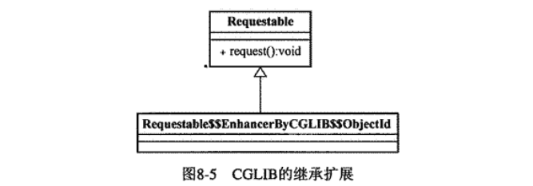
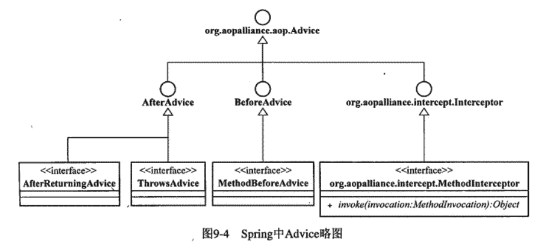
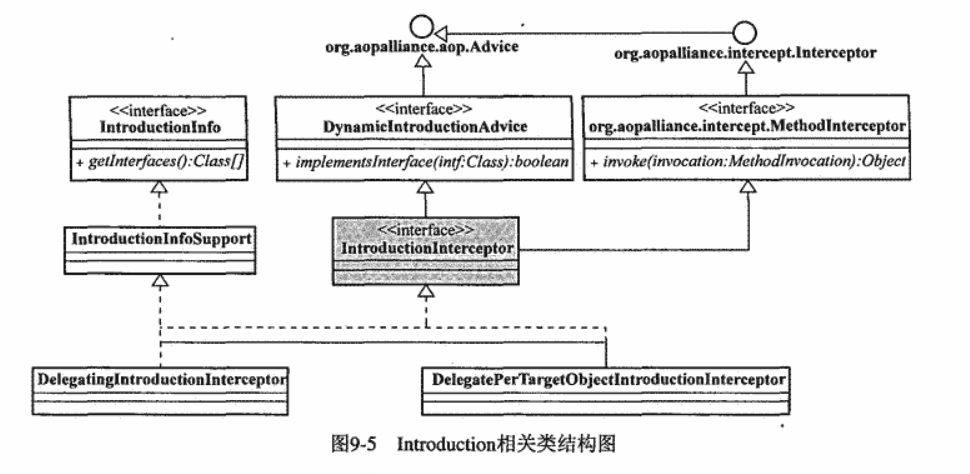
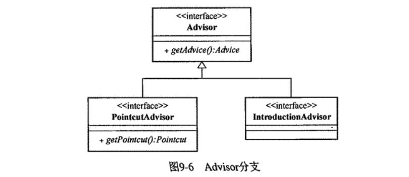
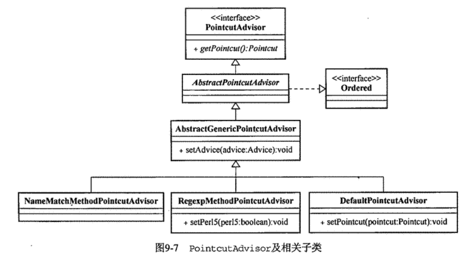
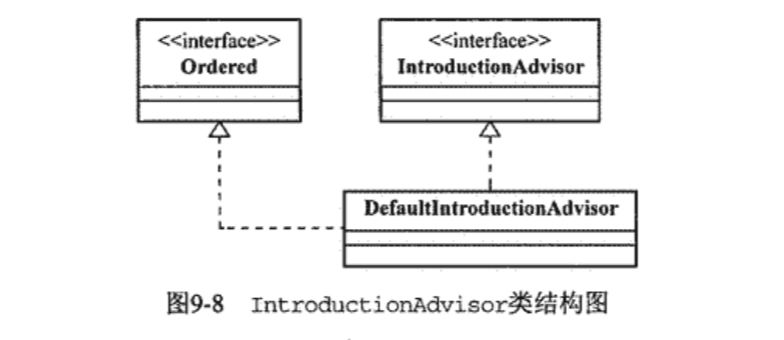
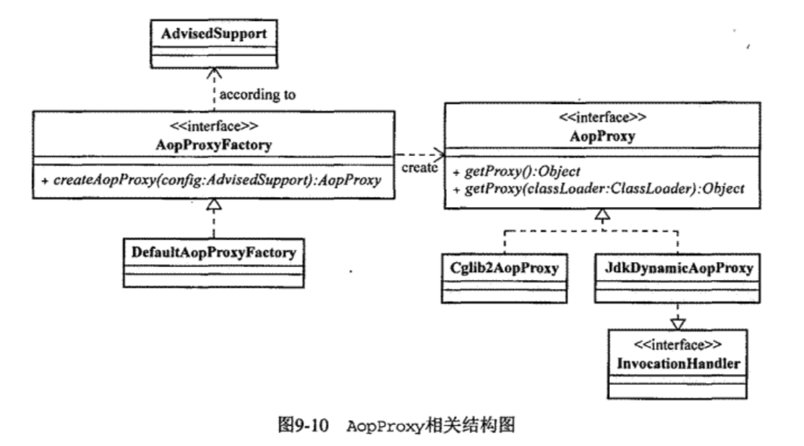
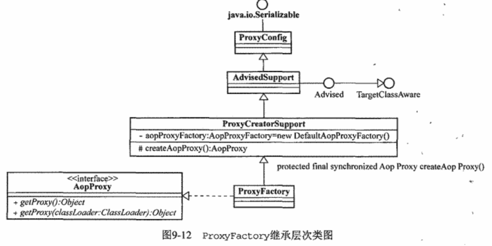
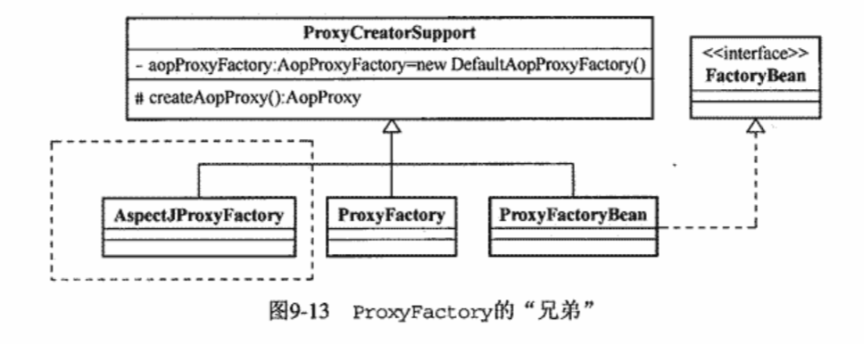
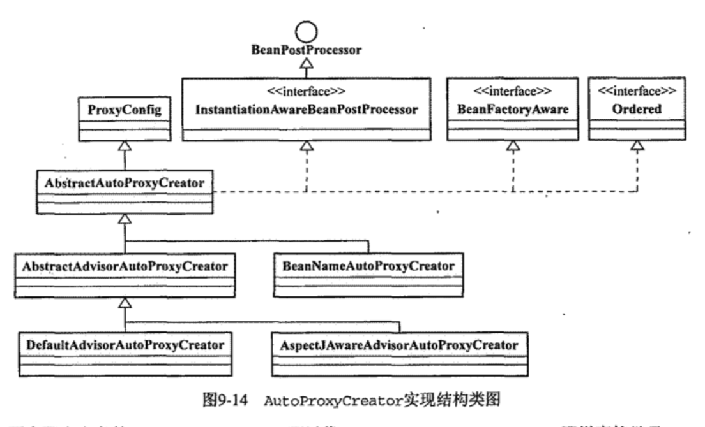

# Spring

## IOC
Spring 提供2种IOC容器：`BeanFactory` `ApplicationContext`
### BeanFactory

BeanFactory 职责：对象的注册和依赖管理

BeanDefinitionRegistry 实现Bean的注册逻辑关系如下：


BeanDefinitionRegistry 管理BeanDefinition(怎么样创建Bean)；  
BeanDefinitionReader 读取BeanDefinition(注解方式则用`classpath-scanning`)；  

BeanFactory 的XML配置

```xml
<beans default-lazy-init default-autowire default-dependency-check default-init-method default-destroy-method>
  <description/>
  <import />
  <alias name="beanName" alias="bean_name"/>
  <bean id="id" class="packag.A" name="beanName" >
    <constructor-arg index="0" ref="otherBeanName"/>
    <constructor-arg type="int">
      <value>123</value>
    </constructor-arg>
    <property name="propertyName" ref="beanName"/>
    <property name="collection">
      <list>
        <value>123</value>
        <ref bean="beanName"/>
        <bean class="beanclassName"/>
      </list>
      <set>
        <value>123</value>
        <ref bean="beanName"/>
        <bean class="beanclassName"/>
      </set>
      <map>
        <entry key="strValueKey">
          <value>something</value>
        </entry>
        <entry>
          <key>objectKey</key>
          <ref bean="someObject"/>
        </entry>
        <entry key-ref="lstKey">
          <list>
            ...
          </list>
        </entry>
      </map>
  </bean>
</beans>
```

Bean Scope : protype singleton request session globalsession
后三种为web应用特有

Scope 接口可以实现自定义Scope类型；

#### 工厂方法与 FactoryBean
1. 静态工厂方法(Static Factory Method) .
```xml
<bean id="foo" class="...Foo"> <property name="barInterface">
  <ref bean="bar"/> </property>
</bean>
<bean id="bar" class="...StaticBarInterfaceFactory" factory-method="getInstance"/>
```
2.非静态工厂方法(Instance Factory Method)
```XML
<bean id="foo" class="...Foo">
  <property name="bar">
    <ref bean="bar"/>
  </property>
</bean>
<bean id="barFactory" class="...NonStaticFactory"/>
<bean id="bar" factory-bean="barFatory" factory-method="getInstance"/>
```

FactoryBean -扩展容器对象实例化逻辑接口，与其他容器对像一样，只是生产对象的工厂；当对象的实例化过程很复杂或第三方库不能直接注册到Spring容器的时候，实现`org.spring- framework.beans.factory.FactoryBean` 给出实例化逻辑
```java
public class NextDayDateFactoryBean implements FactoryBean{
  ......
}

public class NextDayDateDisplayer {
  private DateTime dateOfNextDay;
    // 相应的setter方法
    // ...
}
```
```XML
<bean id="nextDayDateDisplayer" class="...NextDayDateDisplayer">
  <property name="dateOfNextDay">
    <ref bean="nextDayDate"/>
  </property>
</bean>
<bean id="nextDayDate" class="...NextDayDateFactoryBean"> </bean>
```

`BeanFactoryAware`接口-Spring容器在实例化实现该接口bean时会 **自动将容器本身注入该Bean中**

`ObjectFactoryCreatingFactoryBean` Spring的FactoryBean实现，返回ObjectFactory实例，通过ObjectFactory就可以获得Spring容器管理的对象。

`MethodReplacer` 接口可以将获取Bean的方法给替换掉：
```java
public class FXNewsProviderMethodReplacer implements MethodReplacer{
  public Object reimplement(Object target,Method method , Object[] args){
    //do something
    return null;
  }
}
```
```XML
<bean id="djNewsProvider" class="...FXNewsProvider">
  <constructor-arg inde="0">
    <ref bean="djNewsProvider"/>
  </constructor-arg>
  <replaced-method name="getAndPersistNews" replacer="providerReplacer">
  </replaced-method>
</bean>
<bean id="providerReplacer" class="....FXNewsProviderMethodReplacer">
</bean>
```
#### Spring容器IoC启动分2个阶段：
1. 容器启动阶段
  - 加载配置
  - 分析配置信息
  - 装备BeanDefinition
  - 其他.....
2. Bean实例化阶段
  - 实例化对象
  - 装配依赖
  - 生命周期回调
  - 对象其他处理
  - 注册回调接口

BeanFactoryPostProcessor-Spring容器的扩展机制，允许在容器实例化对象前，对注册到容器的BeanDefinition所保存的信息作相应的修改。`PropertyPlaceholderConfigurer`和`PropertyOverrideConfigurer`是比较常用的BeanFactoryPostProcessor

BeanFactory的BeanFactoryPostProcessor
```java
//声明被后处理的BeanFactory实例
ConfigurableListableBeanFactory beanFactory = new XmlBeanFactory(new ClassPathResource("..."));
//声明要使用的BeanFactoryPostProcessor
PropertyPlaceholderConfigur propertyPostProcessor = new PropertyPlaceholderConfigur();
propertyPostProcessor.setLocation(new ClassPathResource("..."));
//执行后处理操作
propertyPostProcessor.postProcessBeanFactory(beanFactory);
```

ApplicationContext 使用BeanFactoryPostProcessor
```XML
<beans>
  <bean class="org.springframework.beans.factory.config.PropertyPlaceholderConfigurer">
    <property name="locations">
      <list>
        <value>conf/jdbc.properties</value>
        <value>conf/mail.properties</value>
      </list>
    </property>
  </bean>
</beans>
```
PropertyOverrideConfigurer -覆盖之前的属性配置值

CustomEditorConfigurer-属性值转换为对象的规则信息；
```java
public class DatePropertyEditor extends PropertyEditorSupport{
  private String dataPatern;

  @override
  public void setAsText(String text)throws IllegalArgumentException{
    DateTimeFormatter dateTimeFormatter = DateTimeFormatter.forPattern(getDatePattern());
    Date dateValue = dateTimeFormatter.parseDateTime(text).toDate();
    setValue(dateValue);
  }
  public String getDatePattern(){
    return datePattern;
  }
  public void setDatePattern(String datePattern){
    this.datePattern = datePattern;
  }
}

public class DateFoo{
  private Date date;

  public Date getDate(){
    return date;
  }

  public void setDate(Date date){
    this.date = date;
  }
}
```
```XML
<bean id="dateFoo" class="....DateFoo">
  <property name="date">
    <value>2007/10/18</value>
  </property>
</bean>
```

BeanFactory 应用CustomerEditorConfigurer到容器：
```java
XmlBeanFactory  beanFactory = new XmlBeanFactory(new ClassPathResource("..."));
CustomEditorConfigurer ceConfig = new CustomEditorConfigurer();
Map customeeEditor = new HashMap();
customeeEditor.put(java.util.Date.class,new DatePropertyEditor());
ceConfig.setCustomerEditors(customeeEditor);
ceConfig.postProcessBeanFactory(beanFactory);
```

ApplicationContext 的使用：
```XML
<bean class="org.springframework.beans.factory.config.CustomEditorConfigurer">
  <property name="customEditors">
    <map>
      <entry key="java.util.Date">
        <ref bean ="datePropertyEditor"/>
      </entry>
    </map>
  </property>
</bean>

<bean id="datePropertyEditor" class="...DatePropertyEditor">
  <property name="datePattern">
    <value>yyyy/mm/dd</value>
  </property>
</bean>
```

Spring 2.0之后将采用`org.springframework.beans. PropertyEditorRegistrar`实现注册新的自定义

Bean的实例化：
1. BeanFactory容器的实例化可以采用延迟初始化策略，`getBean()`才去实例化bean
2. ApplicationContext容器的在启动后会紧接着调用`getBean()`(见`org.springframework.context.support. AbstractApplicationContext.refresh()`);

Bean的实例化过程图如下：


注：`org.springframework.beans.factory.support.AbstractBeanFactory.getBean()`  
`org.springframework.beans. factory.support.AbstractAutowireCapableBeanFactory.createBean()`

1. Bean的实例化与BeanWrapper  
  - 根据`BeanDefinition`返回一个`BeanWrapperImp`实例
  - 对`BeanWrapperImp`包裹着的Bean进行操作：设置属性值等；
2. 各色`Aware`接口  
检查Bean是否实现了Aware结尾的接口  
  - `org.springframework.beans.factory.BeanNameAware`
  - `org.springframework.beans.factory.BeanClassLoaderAware`
  - `org.springframework.beans.factory.BeanFactoryAware`
  - `org.springframework.context.ResourceLoaderAware`
  - `org.springframework.context.ApplicationEventPublisherAware`
  - `org.springframework.context.MessageSourceAware`
  - `org.springframework.context.ApplicationContextAware`
3. BeanPostProcessor  
BeanPostProcessor 存在于对象实例化阶段，而BeanFactoryPostProcessor存在在于容器启动阶段；  
`ApplicationContextAwareProcessor.postProcessBeforeInitialization()`
4. InitializingBean和init-method
5. DisposableBean与destroy-method

## ApplicationContext
ApplicationContext 的默认实现有：
1. `org.springframework.context.support.FileSystemXmlApplicationContext`
2. `org.springframework.context.support.ClassPathXmlApplicationContext`
3. `org.springframework.web.context.support.XmlWebApplicationContext`

### 统一资源加载策略
Spring将资源和资源加载抽象了2个接口：`org.springframework.core.io.Resource` 和 `org.springframework.core.io.ResourceLoader`

`org.springframework.core.io.Resource` 类型：
1. `ByteArrayResource`
2. `ClassPathResource`
3. `FileSystemResource`
4. `UrlResource`
5. `InputStreamResource`

`org.springframework.core.io.ResourceLoader` 实现类：
1. `DefaultResourceLoader`
2. `FileSystemResourceLoader`

ResourcePatternResolver 是 ResourceLoader 的扩展，可以返回多个 Resurce 实例


ApplicationContext 与 ResourceLoader


ApplicationContext 的功能:
1. ResourceLoader的作用
2. ResourceLoader类型的注入；实现`ResourceLoaderAware` 或者 `ApplicationContextAware`,满足 bean 需要依赖 ResourceLoader 查找资源
3. Resource类型的注入-ApplicationContext 在启动时通过`org.springframework.bean.support.ResourceEditorRegisttar` 注册 Resource 类型的 PropertyEditor 实现到容器中。  
```java
public class XMailer{
  private Resource template;

  public void sendMail(Map mailCtx){
    // String mailContext = merge(getTemplate().getInputStream(),mailCtx);
    //...
  }
  // getter and setter
}
```
4. ApplicationContext的Resource加载行为-ClassPathXmlApplicationContext 和 PathXmlApplicationContext 的加载区别

### 国际化
Spring 的国际化：
```XML
<beans>
  <bean id="messageSource" class="org.springframework.context.support.ResourceBundleMessageSource">
    <property name="basename">
      <list>
        <value>messages</value>
        <value>errorcodes</value>
      </list>
    </property>
  </bean>
  ...

</beans>

```

Spring 的 三种 MessageSource 的实现：`StaticMessageSource` `ResourceBundleMessageSource` `ReloadableResourceBundleMessageSource`

### 容器内部事件发布
 Spring 容器内的事件发布类结构分析

 - ApplicationEvent-容器事件  
   - ContextClosedEvent：容器即将关闭时发布的事件
   - ContextRefreshedEvent：容器初始化或刷新发布的事件
   - RequestHandledEvent：Web请求处理后发布的事件，ServletRequestHandledEvent提供特定于JavaEE的Servlet相关事件
- ApplicatonListener-容器监听器  
- ApplicationContext-ApplicationEventPublisher的实现类

###### Spring容器内事件发布实现类图


为业务支持容器内的发布事件：
1. `ApplicationEventPublisherAware` 接口实现
2. `ApplicationContextAware` 接口实现

## Spring IoC容器之扩展篇-`@Autowired` 注解

`@Autowired` 可以放置的位置：
1. Filed/Property
2. 构造方法
3. 方法定义-返回对象

注解的核心处理类：`org.springframework.beans. factory.annotation.AutowiredAnnotationBeanPostProcessor`

`@Qualifier` -明确制定注入容器中的哪个Bean

`@Resource` `@PostConstruct` `@PreDestroy` JSR250标准，需要`org.springframework.context.annotation.CommonAnnotationBeanPostProcessor`

`<context:annotation-config/>` 会自动注册四个Processor：
1. `AutowiredAnnotationBeanPostProcessor`
2. `CommonAnnotationBeanPostProcessor`
3. `PersistenceAnnotationBeanPostProcessor`
4. `RequiredAnnotationBeanPostProcessor`

## AOP
AOP 的实现方式：
1. 动态代理-为 **相应接口** 动态生成代理对象，将横切关注点逻辑封装到动态代理的InvocationHandler 中，在系统运行期间，根据横切点需要织入模块的位置，将横切逻辑织入到相应的代理类中；Spring AOP
2. 动态字节码增强-为需要横切逻辑的模块类在运行期间，通过动态字节码增强技术，为这些系统模块类生成相应的子类，将横切逻辑加到这些子类中，让应用程序在执行期间使用的是动态生成的子类，从而达到将横切逻辑织入系统的目的。不用实现特定接口，但是方法为`final`则无法对子类进行扩展
3. Java 代码生成-EJB的容器提供的声明式事务，已经退休
4. 自定义类加载器
5. AOL扩展-AspectJ 最完美的AOP，代价是需要熟悉一种AOL

### AOP概念
- Joinpoint AOP模块织入OOP功能模块的系统执行点(OOP需要织入AOP的方法)  
  - Method Call：在调用对象上的执行点
  - Method Call Execution：在被调用到的方法逻辑执行的时点
  - Constructor Call
  - Construct Call Excution
  - Field Set
  - Field Get
  - Exception Hanlder Execution：在程序执行过程中，某些类型异常抛出后，对应的异常处理逻辑执行的时点
  - Class initialization
- Pointcut -将横切逻辑织入到系统的过程，需要参照Pointcut规定的Joinpoint信息，向哪些Jointpoint上织入横切逻辑
- Advice -单一横切关注点逻辑的载体，代表会织入到Jointpoint的横切逻辑。  
  - Before Advice
  - After Advice  
    - After returning Advice -Joinpoint执行流程正常完成后，执行Advice
    - After throwing Advice
    - After Advice -不管Jointpoint的执行是否正常结束都会执行的Advice，与`finally` 类似
  - Around Advice
  - Introduction
- Aspect -对系统中的横切关注点逻辑进行模块化封装的AOP概念实体。
- 织入和织入器 -完成横切关注点逻辑到系统的最终织入；SpringAOP的ProxyFactory就是这个功能。
- 目标对象 -被织入横切逻辑的对象

###### AOP概念图


## SpringAOP 概述和实现机制
### SpringAOP-动态代理模式
#### 动态代理
`java.lang.reflect.Proxy` `java.lang.reflect.InvocationHandler` 2个接口组成
```Java
public class RequestCtrlInvocationHanlder implements InvocationHandler{
  private static final Log logger = LogFactory.getLog(RequestCtrlInvocationHanlder.class);

  private Object target;

  public RequestCtrlInvocationHanlder(Object target){
    this.target = target;
  }
  public Object invoke(Object proxy,Method method, Object[] args)throws Throwable{
    if(method.getName().equals('request')){
      TimeOfDay startTime = new TimeOfDay(0,0,0);
      TimeOfDay endTime = new TimeOfDay(5,59,59);
      TimeOfDay currentTime = new TimeOfDay();
      if(currentTime.isAfter(startTime) && currentTime.isBefore(endTime)){
        logger.warn("Service is not available now.");
        return null;
      }
      return method.invoke(target,args);
    }
    return null;
  }
}

/**生成代理对象**/
ISubject subject = (ISubject)Proxy.newProxyInstance(ProxyRunner.class.getClassLoader(),new Class[]{ISubject.class},new RequestCtrlInvocationHanlder(new SubjectImpl()));
subject.request();
```

动态代理机制只能对实现了相应 Interface 的类使用，没有实现任何 Interface 的类是无法使用动态代理生成动态代理对象。

Spring中默认情况下，如果SpringAOP 发现目标对象实现了对应得 Interface 则采用动态代理机制为其生成代理对象实例；对应没有实现任何 Interface 的类则尝试使用CGLIB-动态字节码生成类库，为目标生成动态代理实例。

#### 动态字节码
原理:对目标类进行继承扩展，生成相应的子类，将横切逻辑置于子类中,系统使用扩展后的目标对象的子类，这样就可以达到与代理模式相同的效果;



```java
public class RequestCtrlCallback implements MethodInterceptor{
  public Object intercept(Object object, Method method, Object[] args, MethodProxy proxy) throws Throwable {
    if(method.getName().equals("request")){
      //横切逻辑  
      return proxy.invokeSuper(object, args);
    }
    return null;  
  }
}

Enhancer enhancer = new Enhancer();
enhancer.setSuperclass(Requestable.class);
enhancer.setCallback(new RequestCtrlCallback());

Requestable proxy = (Rquestable)enhancer.create();
proxy.request();
```

CGLIB无法对final方法进行覆写(Override)

## Spring AOP 一世

###  Joinpoint
`org.springframework.aop.Pointcut` Aop中Pointcut顶级抽象，`TruePointcut`实例；

TruePointcut 中的2个对象:`ClassFilter` 和 `MethodMatcher`


常见的Pointcut:
1. `NameMatchMethodPointcut`
2. `JdkRegexpMethodPointcut` 和 `Perl5RegexpMethodPointcut`
3. `AnnotationMatchingPointcut` -注解
4. `ComposablePointcut`
5. `ControlFlowPointcut` -精确定位Ponintcut的位置(Class , Method 结合)

### Advice

SpringAOP-Advice 类结构



Advice 按照其自身实例能否在目标对象类的所有实例中共享，可以划分为 per-class 类型， per-instance 类型

#### `per-class` 类型Advice
该类型Advice实例在所有目标对象类的所有实例间共享，通常提供方法拦截的功能，不能为目标对象保存任何状态或者添加新的特性

1. Before Advice  
  横切逻辑在Jointpoint前执行，在Before Advice执行完成后，程序继续从Joinpoint执行，不会打断程序的执行流程(抛异常了则会将程序中断)  
  使用这个Advice可以进行整个系统的某些资源初始化或者其他的一些准备工作
2. ThrowsAdvice-对应AfterThrowingAdvice
  ThrowsAdvice 用于对系统特定异常情况进行监控，进行统一的异常处理
3. AfterReturningAdvice-`org.springframework.aop.AfterReturningAdvice`接口  
  Spring此Advice可以访问到方法的返回值，但不可以更改返回值  
  批处理的状态入库
4. Around Advice-`org.aopalliance.intercept.MethodInterceptor`接口  
  性能检测
```java
public class PerformanceMethodInterceptor implements MethodInterceptor{
  public Object invoke(MethodInvocation invocation) throws Throwable{
    StopWatch watch = new StopWatch();
    try{
      // 横切逻辑
      watch.start();
      //横切逻辑完成后，一定要调用此方法，否则会Joinpoint调用链会被中断
      return invocation.proceed();
    }finally{
      watch.stop();
    }
  }
}
```

#### `per-instance` 类型的Advice
此类型Advice 会为不同的实例对象保存他们各自的状态及相关逻辑

`Introduction`-Spring中唯一的 `per-instance` 类型 Advice  
可以在不改变目标类定义的情况下，为目标类型添加新的属性以及行为

Spring中，为目标对象添加新的属性和行为必须声明相应的接口以及相应的实现。再通过特定的拦截器将新的接口定义以及实现类中的逻辑附加到目标对象上，
之后目标代理对象就拥有新的状态和行为。这个拦截器就是 **`org.springframework.aop.IntroductionInterceptor`** .

`IntroductionInterceptor` 继承了 `MethodInterceptor` 和 `DynamicIntroductionAdvice`:  
`DynamicIntroductionAdvice` 界定当前的 `IntroductionInterceptor` 为哪些接口提供相应的拦截功能;  
`MethodInterceptor` 帮助处理新添加的接口上的方法调用；  

新增加的接口上的方法调用，则不必去调用 `MethodInterceptor.proceed()` 方法，这里已经是终点了



实现 `Introduction` 的方式: `DynamicInterceptorAdvice`动态分支 和 `IntroductionInfo`静态配置分支

1. `DelegatingIntroductionInterceptor`
```java
public interface IDeveloper{
  void developSoftware();
}

public class Developer implements IDeveloper{
  public void developSoftware(){
    System.out.println("I am happy with programming.");
  }
}
```
  - 新状态和行为接口
  - 新接口的实现类
  - `DelegatingIntroductionInterceptor` 进行拦截  
  ```java
    ITester delegat = new Tester();
    DelegatingIntroductionInterceptor interceptor = new DelegatingIntroductionInterceptor(delegat);
    //进行植入
    ITest tester = (ITest)weaver.weave(developer).with(interceptor).getProxy();
    //developer的新行为
    tester.testSofteware();
  ```
  - 此实现类不是完整的`per-instance`类型的Advice类型，会持有同一个接口的实例
2. `DelegatePerTargetObjectIntroductionInterceptor` 在内部持有一个目标对象与对应Introduction逻辑实现类之间的映射关系

### SpringAOP Aspect



#### PointcutAdvisor 家族



1. `DefaultPointcutAdvisor`  
2. `NameMatchMethodPointcutAdvisor`
3. `RegexpMethodPointcutAdvisor`
4. `DefaultBeanFactoryPointcutAdvisor`

#### IntroductionAdvisor 分支



只有一个默认实现`DefaultIntroductionAdvisor`

#### Ordered 作用
让Advisor实现Ordered接口，可以确定进行AOP时的横切顺序，序号越小，优先级越高

### SpringAOP的织入
`org.springframework.aop.framework.ProxyFactory` 织入器

#### `ProxyFactory`
`ProxyFactory`需要二个基本的东西：
1. 需要织入的目标对象
2. Aspect-即Spring的Advisor  
  - 非`Introduction` 的Advice；ProxyFactory会为Advice构造相应的Advisor(Pointcut.TRUE)
  - `Introduction` 类型Advice：`IntroductionInfo`子类，构造`DefaultIntroductionAdvisor`;`DynamicInterceptorAdvice`子类实现报错

SpringAOP默认采用的基于接口的动态代理，但是在以下三中情况时则采用基于类的代理：  
- 目标类没有实现任何接口
- `ProxyFactory` 的 `ProxyTargetClass` 属性值为True
- `optimize` 属性值为True

`Introduction` 的织入



`ProxyConfig`的5个属性：
1. `proxyTargetClass`-是否基于类进行代理
2. `optimize`-代理对象是否需要进一步进行优化，为True时采用基于类进行代理
3. `opaque`-代理对象是否可强转为Advised
4. `exposeProxy`-生成代理对象时将代理对象绑定到`ThreadLocal`;目标对象需要访问当前代理对象，可以通过`AopContext.currentProxy()`取得；性能考虑，默认为false，
5. `frozen`-true时，代理对象生成的各项信息配置完成不能更改


**ProxyFactory继承层次类图**


**ProxyFactory的兄弟**


##### 容器的织入器- `ProxyFactoryBean`
1. `ProxyFactoryBean`本质(Proxy + FactoryBean)
2. `ProxyFactoryBean`的使用，独有的属性：  
  - `proxyInterfaces`-设置基于接口的代理类型
  - `interceptNames`-制定需要织入目标对象的Advice、拦截器和Advisor  
    - 可以在`interceptName` 最后的一个元素的位置放置目标`bean`定义
    - 元素名称后可以使用通配符
  - `singleton`-在需要返回有状态的代理对象时使用singleton为true，如 Introduction的场合

**注意：**  
如果没有依赖与目标对象的依赖关系，则将目标对象的bean定义声明为内部bean，这样就不会出现 **该引用代理对象的地方，不慎引用了目标对象本身** 如下：
```XML
<bean id="taskProxy" class="org.springframework.aop.framework.ProxyFactoryBean">
  <property name="target">
    <bean class="...MockTask"/>
  </property>
  <property name="proxyInterfaces">
    <list>
      <value>.....ITask</value>
    </list>
  </property>
</bean>
```

##### SpringAOP 的自动代理机制
1. 自动代理的实现原理  
SpringAOP自动代理建立在`BeanPostProcessor` 概念上
2. 可用的`AutoProxyCreator`  
  - `BeanNameAutoProxyCreator`  
  - `DefaultAdvisorAutoProxyCreator`
3. 扩展`AutoProxyCreator`
**SpringAOP自动代理的实现架构**


#### TargetSource


------
# Spring Validation
`Validator` 接口可以在应用各层中使用

`DataBinder` 和 `Validator` 共同组成了 `validation` 包，应用于但不局限于MVC框架

`DataBinder` 和 `BeanWrapper` 都使用 `PropertyEditorSupport` 的实现进行属性值得解析和格式

`core.convert` 包提供通用的类型转换工具，而 `format` 包则用于格式化UI的输入值；但是可以使用 `PropertyEditorSupport` 替代


#### TargetSource
TargetSource 目标对象的容器

TargetSource的实现类：
1. `org.springframework.aop.target.SingletonTargetSource`
2. `org.springframework.apo.target.PrototypeTargetSource`  
  - 目标对象 `scope` 必须声明为 `prototype`
  - 通过 `targetBeanName` 属性制定目标对象 `bean` 定义名称
3. `org.springframework.aop.target.HowSwappableTargetSource`-数据源切换
4. `CommonPoolTargetSource`
5. `ThreadLocalTargetSource`

## SpringAOP二世
### `@AspectJ` 形式的SpringAOP
1. 支持`@AspectJ` 形式的AOP，可以使用注解进行配置AOP
2. 简化XML配置方式，提供了XSD

SpringAOP只使用了AspectJ的类库进行Pointcun解析和匹配，最终实现机制还是SpringAOP自己的架构

AspectJ织入方式：
1. 编程式织入：`org.springframework.aop.aspectj.annotation.AspectJProxyFactory`
2. 自动代理织入：`org.springframework.aop.aspectj.annotation.AnnotationAwareAspectJAutoProxyCreator`

`@AspectJ`形式的Point表达式的标志符
- `execution`  
	1. `*`-任意一个，如：`excution(* *(String))`
	2. `..`-多层次的类型声明，如：`excution(void cn.spring21..*.doSomething(String))`
- `within` -只接受类型声明
- `this` 和 `target`  
	AspectJ中`this`代调用方法一方所在的对象，`target`被调用方法所在的对象
	SpringAOP中`this`指目标对象的代理对象，`target`指目标对象
- `args`
- `@within`-针对注解
- `@target` 
- `@args`	
- `@annotation`

`@AspectJ`形式的`Pointcut` 在SpringAOP中的真实面目  
`org.springframework.aop.aspectj.AspectJExpressionPoincut` 表达式的具体实现

#### `@AspectJ`形式的Advice
Advice注解:
- `@Before`
- `@AfterReturning`
- `@AfterThrowing`
- `@After`
- `@Around`-方法参数中的`JoinPoint`类型参数必须指定，且需要调用`ProceedingJoinPoint.proceed()`
- `@DeclareParents`-Introduction型Advice

#### `@AspectJ`中的Aspect更多话题
##### Advice执行顺序
1. Advice声明在同一个Aspect内时，优先级由声明顺序确定；Befor 优先级高先运行；After 优先级高后运行；
2. Advice在不同的Aspect内时，优先级由`order`接口返回值确定
 
## AOP应用案例
FaultBarrier - 实现一个对应Fault处理Aspect，对系统中所有可能的Fault情况进行处理

## SpringAOP扩展
### 公开当前调用的代理对象的探讨
同一对象内的嵌套方法调用拦截失效，需要暴露代理对象
```java
AopContext.currentProxy().doSomething();
```
以上前提是`ProxyConfig.exposeProxy` 为`true`;


## SpringJDBC最佳实践

### 基于Template的JDBC使用方式
```java

public <T> T execut(ConnectionCallback<T> action) throws DataAccessException;

//-- 静态SQL不带参数 --//
public <T> T execut(StatementCallback<T> action) throws DataAccessException;

//-- 预编译语句 --//
public <T> T execut(PreparedStatementCallback<T> action) throws DataAccessException;

//-- 存储过程 --//
public <T> T execut(CallableStatementCreator csc,CallableStatementCallback<T> action) throws DataAccessException;

```


### 基于操作对象的JDBC使用方式


-----
